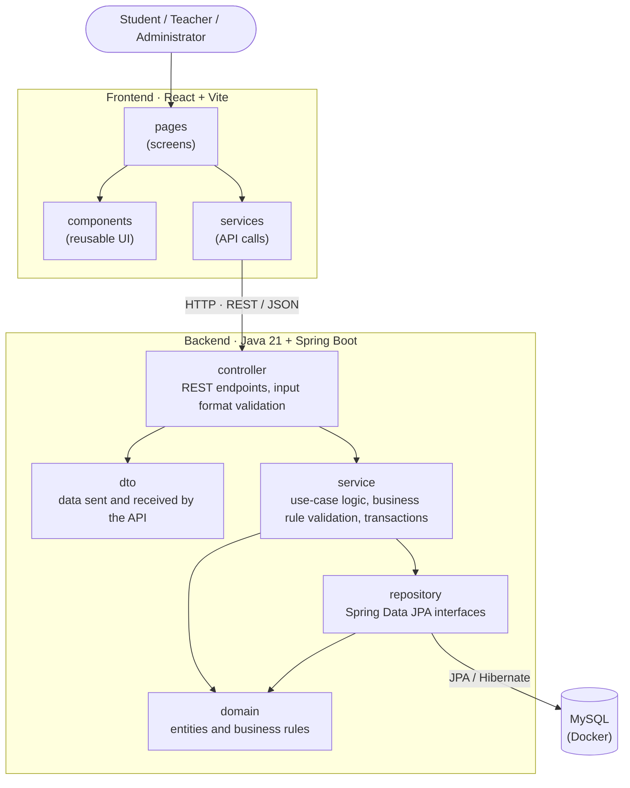

# Architecture

Initial architecture of StudyMatch for Sprint 1. It is a proposal and is expected to change as new requirements arrive in later sprints.

## Overview

StudyMatch is a web application with three parts: a React frontend that runs in the browser, a Spring Boot backend that exposes a REST API, and a MySQL database. The backend is organised in layers, and the business rules live in the domain and service layers, not in the controllers or in the frontend.



## Components

| Component | Responsibility |
|---|---|
| **Frontend – pages** | One page per screen (e.g. student profile, groups of a course unit). Only presentation and navigation. |
| **Frontend – components** | Reusable pieces of UI (tables, forms, cards). |
| **Frontend – services** | All calls to the backend API. Pages never call `fetch` directly, so the API can change in one place. |
| **Backend – controller** | Receives HTTP requests, checks the input format (through the DTO annotations) and returns responses. No business logic. |
| **Backend – dto** | Objects exchanged with the frontend. Keeps the API independent from the internal domain classes. |
| **Backend – service** | Implements the use cases (e.g. record a grade, generate groups). Validates the business rules that depend on the system state, coordinates domain objects and repositories, and defines transactions. |
| **Backend – domain** | The entities from the domain model (Student, CourseUnit, GroupingContext…) and the rules that belong to them, including the student score and the group formation. |
| **Backend – repository** | Access to the database through Spring Data JPA. |
| **Database** | MySQL, run with Docker Compose so every team member has the same setup. |

## Dependencies between components

Dependencies only go in one direction:

- the frontend depends on the API, never on the database;
- controllers depend on services, never on repositories directly;
- services depend on the domain and on repositories;
- the domain does not depend on Spring, controllers or the database.

This keeps the business rules in one place and makes them easy to test with plain unit tests (JUnit), without starting the server or the database.

## Input validation

Validation is split between two layers:

| Layer | What it checks | Examples |
|---|---|---|
| **Controller (DTO)** | The format of the request: required fields, types and value ranges. Uses Bean Validation annotations on the DTOs (`@NotBlank`, `@Email`, `@Min`, `@Max`) and `@Valid` in the controller. Invalid requests are rejected with HTTP 400. | email filled in and well formed; grade between 0 and 20; group size ≥ 2 |
| **Service (and domain)** | The business rules, which depend on the current state of the system and must hold whatever the origin of the request. When a rule fails, a business exception is thrown and returned to the frontend with a clear message. | student number not already used (UC02); enrolment does not exceed 75 ECTS per year or 42 per semester (UC08); teacher assigned to the course unit (UC09); course unit has a knowledge area before a grouping context is created (UC17) |

Keeping the business rules out of the controllers means they are checked in one place and can be tested without the API.

## Communication between frontend and backend

- REST API over HTTP, exchanging JSON.
- All endpoints start with `/api` (e.g. `GET /api/health`, `GET /api/students`).
- In development, the frontend runs on `http://localhost:5173` and the backend on `http://localhost:8080`. CORS is configured in the backend to allow the frontend origin.

## Persistence

- MySQL 8, started with `docker compose`.
- The domain entities are mapped to tables with JPA annotations and Hibernate.
- Repositories are Spring Data JPA interfaces (e.g. `StudentRepository`).
- In Sprint 1 the schema is generated by Hibernate. A migration tool (such as Flyway) may be introduced when the model becomes more stable.

## Where the business rules live

| Rule | Where |
|---|---|
| Grade between 0 and 20, pass with ≥ 10, keep the best grade | `domain` (CourseUnitEnrolment, CreditedCourseUnit) |
| ECTS limits (60 per curricular year, 75/42 per student) | `domain` (StudyPlan, Student) |
| Student score: area average → university average → entry grade | `domain` (Student.calculateScore) |
| Balanced groups close to the class average | `domain` (GroupingContext.generateGroups) |
| Who can see what (privacy, teacher access) | `service` |
| Business rule checks that need stored data (unique student number, ECTS already enrolled, teacher assigned to the course unit) | `service` |
| Input format checks (required fields, types, value ranges) | `controller` / `dto` |

## Prepared for change

The brief says that StudyMatch will evolve, so the design keeps the parts separated:

- **Business rules in the domain.** The scoring and group-formation rules defined by the team live in the domain classes that own the data, so a change to a rule stays in one place.
- **DTOs between the API and the domain.** The domain can change without breaking the frontend, and the other way around.

## Project structure

```
StudyMatch/
├── backend/
│   ├── pom.xml
│   └── src/main/java/pt/studymatch/
│       ├── controller/
│       ├── dto/
│       ├── service/
│       ├── domain/
│       ├── repository/
│       └── config/
├── frontend/
│   ├── package.json
│   └── src/
│       ├── pages/
│       ├── components/
│       └── services/
├── docs/
└── docker-compose.yml
```
